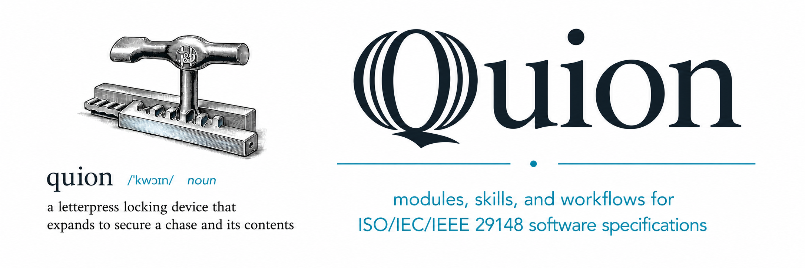

<p align="center">
  
</p>

# Quoin

[](https://discord.gg/6qsdhSPE)
[](https://www.iso.org/standard/72089.html)
[](https://github.com/GoogleCloudPlatform/knowledge-catalog/tree/main/okf)

`quoin` is a bundle of **Quire modules**, **agent skills**, and **workflows** for
authoring [ISO/IEC/IEEE 29148](https://www.iso.org/standard/72089.html)-aligned software specifications and other technical
documents. It includes prepackaged modules for the spec vocabulary and ideation/authoring/review/planning
workflows agents need to write and validate specs directly as Markdown.

`quoin` is built on the [Quire](https://github.com/agent-ix/quire-rs) document standard and validation engine by Agent-IX.

> **Why:** AI agents write code fast but drift from vague intent. Quoin makes the spec the source of truth — your agent authors a validated, traceable spec first, then plans and builds against it.

## How

In Claude Code, Codex, or the coding agent of your choice:

#### 1. Ideate & Specify

Ideate, then pass your idea to `/specify`. A `specification` containing `user stories`, `functional requirements`,
`stakeholder requirements`, `non-functional requirements`, and other artifacts will be created.

```
> /specify an electron app for tracking spice production
```

#### 2. Spec Review

Use `/spec-review` for agent-assisted review. Multiple analysis tasks will run in parallel and output `Reviews`
with `Findings` and suggested fixes.

```
> /spec-review review the specs for the spice production tracker.
```

#### 3. Convert to plans

Build the test `traceability matrix` and `plan`. These skills will break the work down into a `plan`
with multiple `tasks`.

```
> /spec-matrix /spec-to-plan prep the spice tracking app for coding
```

#### 4. Implement!

Call `/implement-plan` to trigger your coding agent to begin work on the plan.

```
> /implement-plan build the spice tracking app
```

#### 5. Gap review

`/gap-analysis` validates that the `UserStory` and `Functional Requirements` are implemented and tested using the `traceability matrix`
as the guide. `/gap-analysis` will optionally perform a _semantic_ comparison of `spec`, `code`, and `tests` to ensure the
`plan` is faithfully implemented.

```
> /gap-analysis
```

## What's included

The default module set defines the spec archetypes and domain-object vocabulary.

**Artifact archetypes** — the document types you author:

| Module                                                                       | Archetypes                                                           |
| ---------------------------------------------------------------------------- | -------------------------------------------------------------------- |
| [spec-artifacts-iso](https://github.com/agent-ix/spec-artifacts-iso)         | `StR`, `FR`, `NFR`, `US`, `IT`, `TC`, `Spec`, `master-requirements`  |
| [spec-artifacts-app](https://github.com/agent-ix/spec-artifacts-app)         | `ApplicationSpec`, `MasterRequirements`                              |
| [spec-artifacts-process](https://github.com/agent-ix/spec-artifacts-process) | `ADR`, `Plan`, `Task`, `Review`, `Finding`, `TestMatrix`, `Standard` |

**Domain objects** — prefab templates for common objects

| Module                                                                             | Objects                                                                                                                                                                                                                                |
| ---------------------------------------------------------------------------------- | -------------------------------------------------------------------------------------------------------------------------------------------------------------------------------------------------------------------------------------- |
| [spec-objects-business](https://github.com/agent-ix/spec-objects-business)         | `domain`, `entity`, `value_object`, `aggregate_root`, `nested_entity`, `repository`, `event`, `state_machine`, `process`, `enumeration`                                                                                                |
| [spec-objects-architecture](https://github.com/agent-ix/spec-objects-architecture) | `api_endpoint`, `data_schema`, `queue`, `action`, `ui_component`, `interface`, `external_contract`, `extension_point`, `binary_format`, `rate_limit`                                                                                   |
| [spec-objects-enterprise](https://github.com/agent-ix/spec-objects-enterprise)     | `capability`, `business_function`, `value_stream`, `decision`, `objective`, `principle`, `kpi`                                                                                                                                         |
| [spec-objects-operational](https://github.com/agent-ix/spec-objects-operational)   | `configuration`, `migration`, `sli`, `slo`, `alert`, `runbook`, `incident`, `deployment`                                                                                                                                               |
| [spec-objects-security](https://github.com/agent-ix/spec-objects-security)         | `auth_flow`, `permission`, `scope`, `role`, `secret`, `encryption_key`, `session_config`, `data_classification`, `trust_boundary`, `audit_event`, `threat`, `control`, `risk`, `vulnerability`, `asset`, `attack_surface`, `policy`, … |

### Agent Skills

- **`specify`** — create or edit spec files using catalog authoring packs + Quire validation
- **`spec-review`** — review specification for quality, consistency, and completeness
- **`spec-matrix`** — build/maintain the requirements Test Matrix at 100% coverage
- **`spec-to-plan`** — convert StR/FR/NFR into a TDD project plan
- **`spec-ideation`** — loose, exploratory drafting before formal authoring
- **`spec-app-review`** / **`spec-object-review`** — application-spec and domain-object audits
- Analysis lenses — focused review passes over a spec:
  - **`spec-integrity-analysis`** — completeness, consistency, and atomicity quality gates
  - **`spec-scope-boundary-analysis`** — system boundaries and responsibility allocation
  - **`spec-dependency-analysis`** — separates enablement work from feature work
  - **`spec-evidence-analysis`** — verification methods and evidence artifacts per requirement
  - **`spec-failure-domain-analysis`** — unstated failure modes, identity confusion, edge cases
  - **`spec-risk-complexity-analysis`** — technical risk and volatility before tasking
  - **`spec-security-analysis`** — applicable security standards and compliance traceability

## Install

Installing quoin is **two steps**: the CLI (from public npm) and a plugin that adds the
[skills](#agent-skills) and workflows to your coding agent. The same skill bundle installs
into **Claude Code, OpenAI Codex, opencode, and GitHub Copilot** — pick your agent below. No
Anthropic API key is required — your existing agent subscription is used.

**1. Install the CLIs** (`quoin` plus `ix-flow`, which runs the workflow lifecycle commands):

```bash
npm install -g @agent-ix/quoin@latest @agent-ix/ix-flow@latest
```

**2. Add the plugin to your coding agent:**

<details>
<summary><b>Claude Code</b></summary>

Run these inside Claude Code:

```text
/plugin marketplace add agent-ix/quoin
/plugin install quoin@quoin
```

</details>

<details>
<summary><b>OpenAI Codex</b></summary>

```bash
codex plugin marketplace add agent-ix/quoin
codex plugin add quoin
```

Or browse and install quoin from the `/plugins` menu inside the Codex TUI.

</details>

<details>
<summary><b>opencode</b></summary>

Install the skills with the GitHub CLI (requires `gh` ≥ 2.90.0). `--all` installs
the whole bundle; `--scope user` makes it available in every repo:

```bash
gh skill install agent-ix/quoin --all --scope user --agent opencode
```

</details>

<details>
<summary><b>GitHub Copilot</b></summary>

With the Copilot CLI:

```bash
copilot plugin marketplace add agent-ix/quoin
copilot plugin install quoin@quoin
```

Or install the skills with the GitHub CLI (requires `gh` ≥ 2.90.0):

```bash
gh skill install agent-ix/quoin --all --scope user --agent github-copilot
```

</details>

Either way, that registers quoin's spec-authoring skills and workflows so you can drive them
by asking the agent.

## Usage

### skills & workflows

The primary way users author specs is by asking an agent, which invokes the bundled
[skills](#agent-skills) and [workflows](#agent-workflows).

### CLI commands

Inspect the spec vocabulary and manage installed modules:

```bash
quoin catalog list
quoin catalog show FR
quoin catalog validate
quoin plugin install path:../spec-objects-business
quoin plugin list
```

## Development

```bash
pnpm install
pnpm run build
pnpm test
pnpm run lint
```

### Specification

The technical specification for this library was itself authored with the `spec-artifacts-iso` module — see
[spec/spec.md](spec/spec.md).

### Evals

Eval scenarios live in [spec/evals.md](spec/evals.md) and run through the shared
[`@agent-ix/cli-agent-evals`](../cli-agent-evals) toolkit. The suite definition is
[`cli-agent-evals.config.mjs`](cli-agent-evals.config.mjs); quoin-specific fixtures,
module seeding, prompts, and assertions remain under [`evals/`](evals/).

Live runs profile a **real** agent running the skills/workflows and record token,
tool, and latency metrics from the available transcript. Unit tests cover the
mechanical CLI behavior.

```bash
make evals
make evals-all
node ../cli-agent-evals/bin/cli-evals.js run \
  --suite ./cli-agent-evals.config.mjs \
  --canary \
  --agent claude \
  --model sonnet
```

Agent plugin setup for authoring/running evals from an agent:

```bash
claude plugin marketplace add agent-ix/cli-agent-evals
claude plugin install cli-agent-evals

codex plugin marketplace add agent-ix/cli-agent-evals
codex plugin add cli-agent-evals

gh skill install agent-ix/cli-agent-evals --all --scope user --agent opencode
gh skill install agent-ix/cli-agent-evals --all --scope user --agent github-copilot
```

Minimal integration pattern:

```js
import { defineSuite } from "../cli-agent-evals/dist/index.js";
import { SCENARIOS } from "./evals/scenarios/index.mjs";

export default defineSuite({
  name: "quoin",
  rootDir: import.meta.dirname,
  scenarios: SCENARIOS,
});
```

## About

quoin is part of the Agent-IX ecosystem built on these core libraries:

- [quire-cli](https://github.com/agent-ix/quire-cli), the static-binary CLI wrapping the Quire engine
- [ix-cli-core](https://github.com/agent-ix/ix-cli-core), the generic CLI framework
  for Agent IX.
