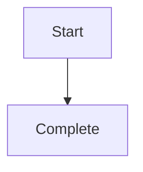

# ${items.fr_answers.fr.id} ${items.fr_answers.fr.title}

## Description

${items.fr_answers.fr.statement}

## Workflow

## Acceptance Criteria

| ID                             | Criteria                                            | Verification Method |
| ------------------------------ | --------------------------------------------------- | ------------------- |
| ${items.fr_answers.fr.id}-AC-1 | The process has explicit start and terminal states. | Inspection          |
